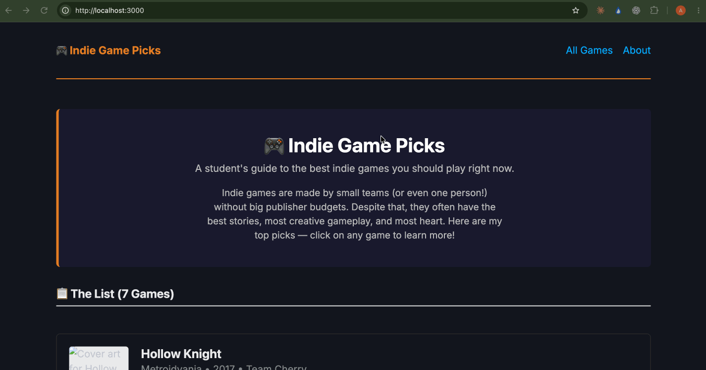

# WEB103 Project 2 - *Indie Game Picks*

Submitted by: **Adhik Adhikari**

About this web app: **A listicle of the 7 best indie games you should play, now powered by a PostgreSQL database on Render. The frontend uses vanilla JavaScript `fetch()` to retrieve game data from a JSON API and render it client-side — no frontend framework used.**

Time spent: **5** hours

## Required Features

The following **required** functionality is completed:

<!-- Make sure to check off completed functionality below -->
- [x] **The web app uses only HTML, CSS, and JavaScript without a frontend framework**
- [x] **The web app is connected to a PostgreSQL database, with an appropriately structured database table for the list items**
  - [x] **NOTE: Your walkthrough added to the README must include a view of your Render dashboard demonstrating that your Postgres database is available**
  - [x] **NOTE: Your walkthrough added to the README must include a demonstration of your table contents. Use the psql command 'SELECT * FROM tablename;' to display your table contents.**

The following **optional** features are implemented:

- [x] The user can search for items by a specific attribute

The following **additional** features are implemented:

- [x] Live search filters by title, genre, AND developer simultaneously without re-fetching from the server
- [x] Games sorted by rating (highest first) from the database
- [x] Distinct 404 vs. server error handling on the detail page
- [x] Loading spinners shown while data is being fetched from the database
- [x] Dark mode support via CSS `prefers-color-scheme`

## Video Walkthrough

Here's a walkthrough of implemented required features:

<!-- Replace this with whatever GIF tool you used! -->
GIF created with [LICEcap](https://www.cockos.com/licecap/)
<!-- Recommended tools:
[Kap](https://getkap.co/) for macOS
[ScreenToGif](https://www.screentogif.com/) for Windows
[peek](https://github.com/phw/peek) for Linux. -->

## Notes

Challenges encountered while building the app:

- Restructuring from Project 1's SSR approach (server renders HTML) to a client-side fetch architecture required rethinking how routes work — the server now serves `game.html` for any `/games/:slug` URL and lets the client JS parse the slug from `window.location.pathname`.
- Render-hosted PostgreSQL requires `ssl: { rejectUnauthorized: false }` in the `pg.Pool` config — without this the connection is silently refused.
- Since there's no bundler, helper functions like `renderStars()` are duplicated between `app.js` and `game.js` to keep each file self-contained.

## License

Copyright 2026 Adhik Adhikari

Licensed under the Apache License, Version 2.0 (the "License"); you may not use this file except in compliance with the License. You may obtain a copy of the License at

> http://www.apache.org/licenses/LICENSE-2.0

Unless required by applicable law or agreed to in writing, software distributed under the License is distributed on an "AS IS" BASIS, WITHOUT WARRANTIES OR CONDITIONS OF ANY KIND, either express or implied. See the License for the specific language governing permissions and limitations under the License.
